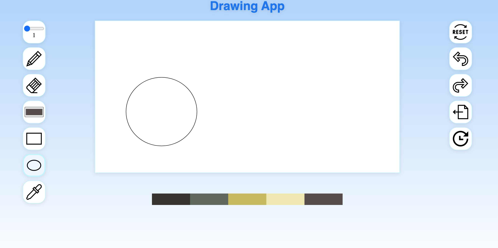

# Module 1: Pixel Art Web App 
This web app was created using HTML, CSS, vanilla JS, and the Canvas API. 

# Live Site
https://czhu-24.github.io/perscholas-week5-pixelart

# Approach
I was torn between making a turn-based game using Canvas or making a pixel art editor using Canvas. I settled on the art editor because, at the time, that seemed simpler and it wouldn't involve classes. I then moved onto more of a freehand drawing app because Canvas allows for so much detail while drawing, so the pixel art idea seemed like a waste.

I basically made a list of drawing features that Paint or Photoshop might have and tried to implement them. It turns out that Canvas supports two primitive shapes: rectangles and paths. Paths are a list of points connected by lines and everything besides rectangles are paths. 

When I started off this project, I didn't think of how to make this code maintainable for the future. There shouldn't be so many global variables.

# Motivation
I wanted to make a drawing app using something that I had never used before, Canvas.

# Screenshot

# Features
- pencil tool
- eraser 
- color selector
- rectangle/square tool
- ellipse/circle tool
- eyedropper
- undo/redo actions
- color palette to get you started

# Improvements/unsolved problems
- Ellipse/circle tool is buggy. The switch from circle to rectangle isn't smooth and the circle isn't as responsive as I would like. Probably need to do some more geometry to finetune this. 
- The rectangle/square tool won't draw if you get to the very edge of the canvas.
- Code is so spaghetti it could legally be considered a pasta dish. 🤡 Should have divided the js file into more module files.
- Show fireworks or confetti (didn't decide) on export button click. would use more CSS animations.
- Make website more responsive to different screen sizes
- Bucket tool was a previous stretch goal... 

# How to use?
Click on the buttons and draw on the Canvas like you might any other drawing app (Paint, Krita, etc).

